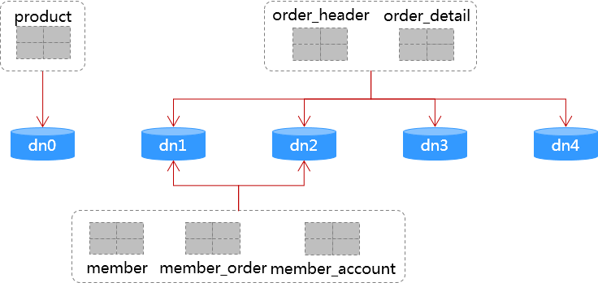

以简单的B2C商城作为示例，演示几个关键场景，以此：
- 了解mycat分库分表使用方法；
- 典型场景使用分库分表后的解决方案；

### Demo应用：表结构、分片规则
[mycat-dn0.sql](mycat-demo/src/main/resources/mycat-dn0.sql)：`dn0`的建表语句，包含`product`表，以及用于mycat全局序列的mysql function；
[mycat-dn1-4.sql](mycat-demo/src/main/resources/mycat-dn1-4.sql)：`dn 1-4`的建表语句，根据下图执行相应建表SQL；



- `product`: 产品表，不分片，存`dn0`
- `member`: 会员表 <br />
  _分片字段_：`member_id` <br />
  _分片规则_：`(member_id % 32) => { 0-15: dn1, 16-31: dn2 }` <br />
  _数据节点_：`dn1`, `dn2`
- `member_account`: 会员账号`account`与`member_id`对应关系，主键`account` <br />
  会员使用`account` + `password`登录为高频场景，因此添加`member_account`表，相当于由应用自行维护的一个索引；没有使用分片拆分时，在`member`表上为`account`字段建一个唯一索引即可，分片后`member_account`的作用即相当于这个唯一索引。 <br />
  _分片字段_：`account_hash`，即`account`的`hashcode`绝对值<br />
  _分片规则_：`(account_hash % 2) => { 0: dn1, 1: dn2 }`<br />
  _数据节点_：`dn1`, `dn2` 
- `order_header`, `order_detail`: 订单主表、明细表，都以`order_id`分片，存`dn1`, `dn2`, `dn3`, `dn4` <br />
  _分片字段_：`order_id`<br />
  _分片规则_：`(member_id % 32) => { 0-7: dn1, 8-15: dn2, 16-23: dn3, 24-31: dn4 }`<br />
  _数据节点_：`dn1`, `dn2`, `dn3`, `dn4`
- `member_order`: 会员订单`order_id`与`member_id`对应关系，主键`member_id` + `order_id`，以`member_id`分片，存`dn1`, `dn2` <br />
  作用同`member_account`表，分片后应用自行维护的一个索引，用于会员查询自己的订单；<br />
  分片规则与`member`表完全一样；

### Demo应用：示例场景
1. 用户使用手机号注册（手机号作为登录账号）
   ```java
   Member registerByMobile(String mobile, String password, String email, String nickname);
   ```
2. 用户登录
   ```java
   Member login(String account, String password);
   ```
3. 提交订单
   ```java
   Order createOrder(Cart cart);
   ```
4. 查询会员订单
   ```java
   List<Order> findMemberOrders(long memberId, int offset, int count);
   ```
5. 查询订单明细
   ```java
   List<OrderDetail> getOrderDetails(long orderId);
   ```

### MyCat管理
```sh
./mycat-server/bin/mycat start
./mycat-server/bin/mycat stop
./mycat-server/bin/mycat console
```
mycat启动之后，在Mac OSX环境通过mysql客户端连接mycat，需要指定protocol为TCP，否则即使指定了mycat的8066端口，在没有任何报错信息的情况下，连接的是3306上的mysql
```sh
mysql -h localhost -P 8066 -uroot -p --protocol=TCP
mysql -h localhost -P 9066 -uroot -p --protocol=TCP
```
登录mycat的账号密码，使用`server.xml`中`<user>`节点的配置。
登录mycat管理端口9066后，执行`show @@database;`显示`schema.xml`中的schema名称列表：
```
+-------------+
| DATABASE    |
+-------------+
| test_schema |
+-------------+
```
执行`show @@datasource;`显示所有datanode节点：
```
+----------+-----------+-------+-----------+------+------+--------+------+------+---------+-----------+------------+
| DATANODE | NAME      | TYPE  | HOST      | PORT | W/R  | ACTIVE | IDLE | SIZE | EXECUTE | READ_LOAD | WRITE_LOAD |
+----------+-----------+-------+-----------+------+------+--------+------+------+---------+-----------+------------+
| dn1      | localhost | mysql | localhost | 3306 | W    |      0 |    1 |   10 |      26 |         0 |          0 |
| dn0      | localhost | mysql | localhost | 3306 | W    |      0 |    1 |   10 |      26 |         0 |          0 |
| dn3      | 127.0.0.1 | mysql | 127.0.0.1 | 3306 | W    |      0 |    1 |   10 |      26 |         0 |          0 |
| dn2      | localhost | mysql | localhost | 3306 | W    |      0 |    1 |   10 |      26 |         0 |          0 |
| dn4      | 127.0.0.1 | mysql | 127.0.0.1 | 3306 | W    |      0 |    1 |   10 |      26 |         0 |          0 |
+----------+-----------+-------+-----------+------+------+--------+------+------+---------+-----------+------------+
```

### Tips
1. 测试了mycat数据库方式的全局序列sequence（`order_detail.detail_id`），简单使用多线程单机验证，功能正常；
2. mycat的全局序列不太方便直接用于分片键，`insert`数据后，未找到有效获取本次生成的sequance值的方法；<br />
   演示应用中的`member_id`，可以使用mycat的全局序列，方案如下：
   1. 注册会员时，先`insert` `member_account`表，`insert`过程中使用mycat全局序列生成`member_id`值；
   2. 在`insert`的DAO方法上，可以使用mybatis的`selectKey`获取到本次生成的`member_id`值：
      ```java
      @Insert("insert into member_account(account, account_hash, member_id) values (#{account}, #{accountHash}, #{memberId})")
      @SelectKey(before=false, keyColumn="member_id", keyProperty="memberId", resultType=Long.class, statementType=StatementType.PREPARED
          , statement="select member_id from member where account=#{account} and account_hash=#{accountHash}")
      int createMemberAccount(MemberAccount ma);
      ```
   3. 使用`member_id`值插入`member`表；
3. mycat 2.0在开发中，参考[Mycat2](https://github.com/MyCATApache/Mycat2) <br />
   从新特性来看，结果集缓存、自动集群管理、支持负载均衡等主要特性，方向偏了，mycat应该朝彻底无状态化、为mycat server降压减负的方向上做到极致，负载均衡、集群管理、缓存等，完全交由外围管理。
4. 简单性能对比测试 <br />
   Mac book pro，单机测试，50并发线程，对相同的业务逻辑功能（用户使用手机号+密码注册会员）进行测试，TPS指被测试业务逻辑的每秒执行次数（包含`select from member_account` + `insert into member` + `insert into member_account`）：
   - mycat + mybatis，分片: TPS在2200上下波动；
   - mybatis，不分片: TPS在2600上下波动；
   - 纯JDBC，不分片: TPS在3400上下波动；<br />
   单机测试，mycat server的CPU占用对测试结果有一定影响。<br />
   受单机资源限制，测试结果TPS高低不反映数据库吞吐率，而是反映平均执行时间，TPS越高执行速度越快。从结果看，中间加一层mycat后性能有一定下降，但幅度不大，不及mybatis与原生JDBC之间的差异。
5. 分片方案：
   - 尽量建立一层虚拟分片到实际物理节点的映射，方便物理节点扩容；
   - 分片算法的选择，充分考虑扩容时的数据迁移尽量简单方便；
   - 分片算法的选择，充分考虑其对高并发插入时的热点问题、XA事物问题；
6. 不要依赖mycat的XA事物；
